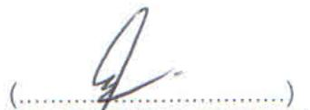
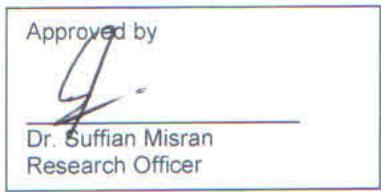
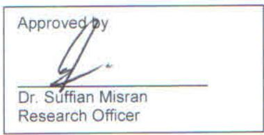
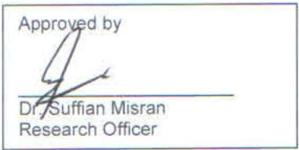

Your reference:

Our reference: FRIM (S).600-5/6/5 Klt. 12(39)

Date:4 September 2020

# CONFIDENTIAL

Reimagine ME Sdn. Bhd,

21-1 Jalan Putera Mahkota

7/6 B, Seksyen 7, Putera Height

47650 Subang Jaya, Selangor

(Attn. Mr. Holy Lim)

Sir,

# EFB STRAND BOARD (OPLY)

Referring to the above, enclosed is report of EFB Strand Board (OPLY) sample tested for bending, internal bond, surface soundness, screw withdrawal, thickness swelling and water absorption.

Thank you.

Yours sincerely,

DR. SUFFIAN MISRAN

for Director General

FRIM

# CONFIDENTIAL

# TEST REPORT

<table><tr><td colspan="2">Job No.: 23/20</td></tr><tr><td>This report consists of 7 pages</td><td>Page 1 of 7</td></tr><tr><td colspan="2">This report is neither a certificate of quality nor an approval certificate. This report only covers samples supplied by the customer to be tested at FRIM. Wood Composite Testing Laboratory is not responsible in the selection of samples for testing. This report or any part of it cannot be published or used for any other purposes except with the permission from FRIM. Test marked &quot;Not SAMM Accredited&quot; in this report are not included in the SAMM Accreditation Schedule of our laboratory.</td></tr></table>

# CUSTOMER

Name and Address:

Reimagine ME Sdn. Bhd.

21-1 Jalan Putera Mahkota

7/6 B, Seksyen 7, Putera Height

47650 Subang Jaya, Selangor

# SAMPLE DESCRIPTION

WCTL serial number:

1240620

Type of material & identity:

EFB Strand Board (OPLY)

Thickness - 12mm

Date received:

27 July 2020

Note:

Test specimens were prepared by customer. The test specimens will be disposed after testing has been carried out.

# TEST METHOD

Tested for and standard method used:

1. Bending (BS EN 310: 1993)   
2. Internal bond (BS EN 319: 1993)*   
3. Surface soundness (BS EN 311: 2002)*   
4. Screw withdrawal (BS EN 320: 2011)*   
5. Thickness swelling (BS EN 317:1993)*   
6. Water absorption (In-house method)*

Date of test:

28 July 2020 - 6 August 2020

Not SAMM Accredited

  
CONFIDENTIAL

# CONFIDENTIAL

# TEST REPORT

<table><tr><td colspan="2">Job No.: 23/20</td></tr><tr><td>This report consists of 7 pages</td><td>Page 2 of 7</td></tr><tr><td colspan="2">This report is neither a certificate of quality nor an approval certificate. This report only covers samples supplied by the customer to be tested at FRIM. Wood Composite Testing Laboratory is not responsible in the selection of samples for testing. This report or any part of it cannot be published or used for any other purposes except with the permission from FRIM.</td></tr></table>

# TEST RESULTS

Table 1: Bending (BS EN 310: 1993) - EFB Strand Board (OPLY)   

<table><tr><td>Specimen</td><td>Modulus of 
Rupture 
(N/mm2)</td><td>Modulus of 
Elasticity 
(N/mm2)</td></tr><tr><td>1</td><td>28.5</td><td>1740</td></tr><tr><td>2</td><td>23.8</td><td>1570</td></tr><tr><td>3</td><td>38.2</td><td>2220</td></tr><tr><td>4</td><td>34.5</td><td>2220</td></tr><tr><td>5</td><td>36.2</td><td>2110</td></tr><tr><td>6</td><td>32.2</td><td>1860</td></tr><tr><td>7</td><td>25.4</td><td>1600</td></tr><tr><td>8</td><td>31.6</td><td>1720</td></tr><tr><td>9</td><td>37.4</td><td>2060</td></tr><tr><td>10</td><td>34.1</td><td>1950</td></tr><tr><td>Average</td><td>32.2</td><td>1910</td></tr><tr><td>Std. Deviation</td><td>4.9</td><td>244</td></tr></table>

CONFIDENTIAL

# CONFIDENTIAL

# TEST REPORT

<table><tr><td colspan="2">Job No.: 23/20</td></tr><tr><td>This report consists of 7 pages</td><td>Page 3 of 7</td></tr><tr><td colspan="2">This report is neither a certificate of quality nor an approval certificate. This report only covers samples supplied by the customer to be tested at FRIM. Wood Composite Testing Laboratory is not responsible in the selection of samples for testing. This report or any part of it cannot be published or used for any other purposes except with the permission from FRIM.</td></tr></table>

# TEST RESULTS

Table 2: Internal Bond (BS EN 319: 1993) - EFB Strand Board (OPLY)   

<table><tr><td>Specimen</td><td>Internal Bond (N/mm2)</td></tr><tr><td>1</td><td>1.90</td></tr><tr><td>2</td><td>1.73</td></tr><tr><td>3</td><td>1.26</td></tr><tr><td>4</td><td>0.70</td></tr><tr><td>5</td><td>0.84</td></tr><tr><td>6</td><td>0.60</td></tr><tr><td>7</td><td>1.85</td></tr><tr><td>8</td><td>0.56</td></tr><tr><td>9</td><td>0.60</td></tr><tr><td>10</td><td>1.54</td></tr><tr><td>Average</td><td>1.16</td></tr><tr><td>Std. Deviation</td><td>0.56</td></tr></table>

CONFIDENTIAL

# CONFIDENTIAL

# TEST REPORT

<table><tr><td colspan="2">Job No.: 23/20</td></tr><tr><td>This report consists of 7 pages</td><td>Page 4 of 7</td></tr><tr><td colspan="2">This report is neither a certificate of quality nor an approval certificate. This report only covers samples supplied by the customer to be tested at FRIM. Wood Composite Testing Laboratory is not responsible in the selection of samples for testing. This report or any part of it cannot be published or used for any other purposes except with the permission from FRIM.</td></tr></table>

# TEST RESULTS

Table 3: Surface Soundness (BS EN 311: 2002) - EFB Strand Board (OPLY)   

<table><tr><td>Specimen</td><td>Surface Soundness (N/mm2)</td></tr><tr><td>1</td><td>2.92</td></tr><tr><td>2</td><td>1.71</td></tr><tr><td>3</td><td>3.00</td></tr><tr><td>4</td><td>2.80</td></tr><tr><td>5</td><td>1.42</td></tr><tr><td>6</td><td>2.46</td></tr><tr><td>7</td><td>2.48</td></tr><tr><td>8</td><td>3.21</td></tr><tr><td>9</td><td>2.57</td></tr><tr><td>10</td><td>2.08</td></tr><tr><td>Average</td><td>2.46</td></tr><tr><td>Std. Deviation</td><td>0.58</td></tr></table>

CONFIDENTIAL

# CONFIDENTIAL

# TEST REPORT

<table><tr><td colspan="2">Job No.: 23/20</td></tr><tr><td>This report consists of 7 pages</td><td>Page 5 of 7</td></tr><tr><td colspan="2">This report is neither a certificate of quality nor an approval certificate. This report only covers samples supplied by the customer to be tested at FRIM. Wood Composite Testing Laboratory is not responsible in the selection of samples for testing. This report or any part of it cannot be published or used for any other purposes except with the permission from FRIM. Test marked “Not SAMM Accredited” in this report are not included in the SAMM Accreditation Schedule of our laboratory.</td></tr></table>

# TEST RESULTS

Table 4: Screw Withdrawal (BS EN 320: 2011) - EFB Strand Board (OPLY)   

<table><tr><td>Specimen</td><td>Screw Withdrawal (Face)
(N/mm)</td></tr><tr><td>1</td><td>138</td></tr><tr><td>2</td><td>148</td></tr><tr><td>3</td><td>140</td></tr><tr><td>4</td><td>105</td></tr><tr><td>5</td><td>152</td></tr><tr><td>6</td><td>187</td></tr><tr><td>7</td><td>187</td></tr><tr><td>8</td><td>181</td></tr><tr><td>9</td><td>252</td></tr><tr><td>10</td><td>248</td></tr><tr><td>Average</td><td>174</td></tr><tr><td>Std. Deviation</td><td>48</td></tr></table>

CONFIDENTIAL

# CONFIDENTIAL

# TEST REPORT

<table><tr><td colspan="2">Job No.: 23/20</td></tr><tr><td>This report consists of 7 pages</td><td>Page 6 of 7</td></tr><tr><td colspan="2">This report is neither a certificate of quality nor an approval certificate. This report only covers samples supplied by the customer to be tested at FRIM. Wood Composite Testing Laboratory is not responsible in the selection of samples for testing. This report or any part of it cannot be published or used for any other purposes except with the permission from FRIM.</td></tr></table>

# TEST RESULTS

Table 5: Thickness Swelling (BS EN 317: 1993) - EFB Strand Board (OPLY)   

<table><tr><td>Specimen</td><td>Thickness Swelling (%)</td></tr><tr><td>1</td><td>7.2</td></tr><tr><td>2</td><td>6.2</td></tr><tr><td>3</td><td>5.9</td></tr><tr><td>4</td><td>6.8</td></tr><tr><td>5</td><td>6.1</td></tr><tr><td>6</td><td>6.3</td></tr><tr><td>7</td><td>6.5</td></tr><tr><td>8</td><td>6.9</td></tr><tr><td>9</td><td>6.1</td></tr><tr><td>10</td><td>6.3</td></tr><tr><td>Average</td><td>6.4</td></tr><tr><td>Std. Deviation</td><td>0.4</td></tr></table>

Note: Specimens were soaked in $20^{\circ}\mathrm{C}$ water for 24 hours

CONFIDENTIAL

# CONFIDENTIAL

# TEST REPORT

<table><tr><td colspan="2">Job No.: 23/20</td></tr><tr><td>This report consists of 7 pages</td><td>Page 7 of 7</td></tr><tr><td colspan="2">This report is neither a certificate of quality nor an approval certificate. This report only covers samples supplied by the customer to be tested at FRIM. Wood Composite Testing Laboratory is not responsible in the selection of samples for testing. This report or any part of it cannot be published or used for any other purposes except with the permission from FRIM.</td></tr></table>

# TEST RESULTS

Table 6: Water Absorption (In-house method) - EFB Strand Board (OPLY)   

<table><tr><td>Specimen</td><td>Water Absorption (%)</td></tr><tr><td>1</td><td>58.6</td></tr><tr><td>2</td><td>39.5</td></tr><tr><td>3</td><td>31.0</td></tr><tr><td>4</td><td>53.8</td></tr><tr><td>5</td><td>33.7</td></tr><tr><td>6</td><td>33.2</td></tr><tr><td>7</td><td>58.2</td></tr><tr><td>8</td><td>61.1</td></tr><tr><td>9</td><td>30.2</td></tr><tr><td>10</td><td>28.8</td></tr><tr><td>Average</td><td>42.8</td></tr><tr><td>Std. Deviation</td><td>13.4</td></tr></table>

Note: ${50}\mathrm{\;{mm}} \times  {50}\mathrm{\;{mm}}$ specimens were soaked in ${20}^{ \circ  }\mathrm{C}$ water for 24 hours, followed by weight increment determination

CONFIDENTIAL