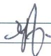
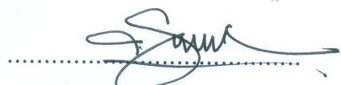
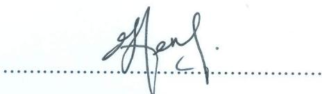

# TEST REPORT

<table><tr><td>LABORATORY: MECHANICAL (ML)
SERIES NO: FIDEC/10/2020
TEST SAMPLE RECEIVED: 26 JUN 2020</td><td>DATE OF REPORT: 10 JUL 2020</td></tr><tr><td>COMPANY/ORGANIZATION:
LEMBAGA MINYAK SAWIT
MALAYSIA(MPOB),
JALAN SEKOLAH, PEKAN BANGI LAMA,
43000 KAJANG, SELANGOR</td><td>CONTACT PERSON: MR.ZAWAWI
IBRAHIM
TEL: 013-3547590
FAX:
EMAIL: zawawi@mpob.gov.my</td></tr><tr><td colspan="2">TYPE OF MATERIAL: SB BOARD 12mm
QUANTITY:
10 PCS - BENDING STRENGTH
10 PCS - THICKNESS SWELLING/ WATER ABSORPTION
10 PCS - INTERNAL BONDING
10 PCS - SCREW WITHDRAWAL (FACE)
10 PCS - SURFACE SOUNDNESS</td></tr><tr><td colspan="2">TEST REQUIREMENTS:
• BS EN 310:1993 - Wood based panels. Determination of Modulus of Elasticity in Bending and of Bending Strength
• *BS EN 319:1993 - Particleboards and fibreboards. Determination of tensile strength perpendicular the plane.
• *BS EN 317: 1993 - Particleboards and fibreboards. Determination of swelling in thickness after immersion in water
• *BS EN 320:2011 - Particleboards and fibreboards. Determination of resistance to axial withdrawal of screws.
• *BS EN 311:2002 - Wood based panels. Surface Soundness. Test Method.</td></tr><tr><td colspan="2">CONFORMANCE TO TEST REQUIREMENTS:
Sample FIBREBOARD (refers as a FIDEC/10/2020) has been tested according to BS EN 310:1993, BS EN 319: 1993, BS EN 317: 1993, BS EN 320:2011, BS EN 311:2002.</td></tr><tr><td colspan="2">APPROVED SIGNATORY:
(Available at
(DR. LOH YUEH FENG)</td></tr></table>

Series No.: FIDEC/10/20

Page 1 of 3

<table><tr><td rowspan="2">DATE OF TEST:</td><td>START : 27 JUN 2020</td></tr><tr><td>END : 03 JUL 2020</td></tr><tr><td>TEMPERATURE TESTING ROOM:</td><td>23.5°C</td></tr><tr><td>RELATIVE HUMIDITY TESTING ROOM</td><td>50.2%
%</td></tr><tr><td colspan="2">NUMBER OF SAMPLES : FIDEC/10/20</td></tr></table>

BS EN 310: 1993 Wood based panels. Determination of modulus of elasticity in bending and of bending strength.   

<table><tr><td>No.</td><td>TEST DESCRIPTION</td><td>RESULT</td><td>STDV</td><td>CV%</td></tr><tr><td>1.0</td><td>Modulus of Rupture (MOR)</td><td>39.6 MPa</td><td>3.75</td><td>9.48%</td></tr><tr><td>2.0</td><td>Modulus of Elasticity (MOE)</td><td>2180 MPa</td><td>183.94</td><td>8.45%</td></tr></table>

* BS EN 319:1993 Particleboards and fibreboards- Determination of tensile strength perpendicular to the plane   

<table><tr><td>SAMPLE</td><td>Internal Bonding (MPa)</td></tr><tr><td>1.0</td><td>1.8 MPa</td></tr></table>

* BS EN 317: 1993 - Particleboards and fibreboards. Determination of swelling in thickness after immersion in water   

<table><tr><td rowspan="3">Sample</td><td rowspan="3">Hours</td><td colspan="3">Thickness Swelling</td><td colspan="3">Water Absorption</td></tr><tr><td rowspan="2">(%)</td><td colspan="2">(mm)</td><td rowspan="2">(%)</td><td colspan="2">(gram)</td></tr><tr><td>Before</td><td>After</td><td>Before</td><td>After</td></tr><tr><td>1.0</td><td>24</td><td>9.0</td><td>11.72</td><td>12.78</td><td>34.6</td><td>21.74</td><td>29.19</td></tr></table>

*BS EN 320:2011 - Particleboards and fibreboards. Determination of resistance to axial withdrawal of screws.   

<table><tr><td rowspan="2">SAMPLE</td><td colspan="3">Screw Withdrawal</td></tr><tr><td colspan="2">Face</td><td>Edge</td></tr><tr><td rowspan="2">1.0</td><td>Max Force (N)</td><td>Screw strength
(N/mm)</td><td>Max Force (N)</td></tr><tr><td>1993</td><td>173.1</td><td>NR</td></tr></table>

*BS EN 311:2002 - Wood based panels. Surface Soundness. Test Method.   

<table><tr><td>SAMPLE</td><td>Surface Soundness (MPa)</td></tr><tr><td>1.0</td><td>2.64 MPa</td></tr></table>

* non accredited test   
* NR- no relevant

Note:

This report is neither a certificate of quality nor an approval certificate. This report is only covers sample supplied by customer to be tested at MTIB. Mechanical Testing Laboratory is not responsible in selection of samples for testing. This report or any part of it cannot be published or used of any other purpose except with the permission from MTIB.

TESTED BY:

MOHD RADZI BIN BUANG

TECHNICAL ASSISTANT

CHECKED BY:

DR LOH YUEH FENG

APPROVED SIGNATORY