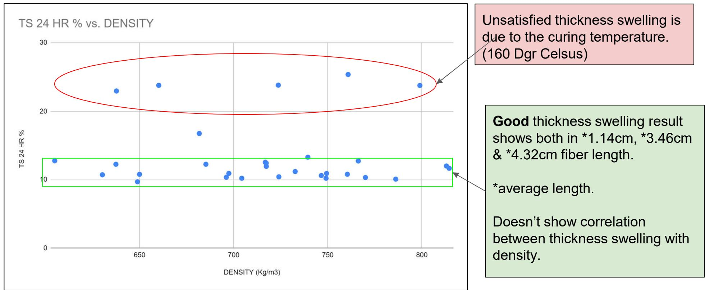
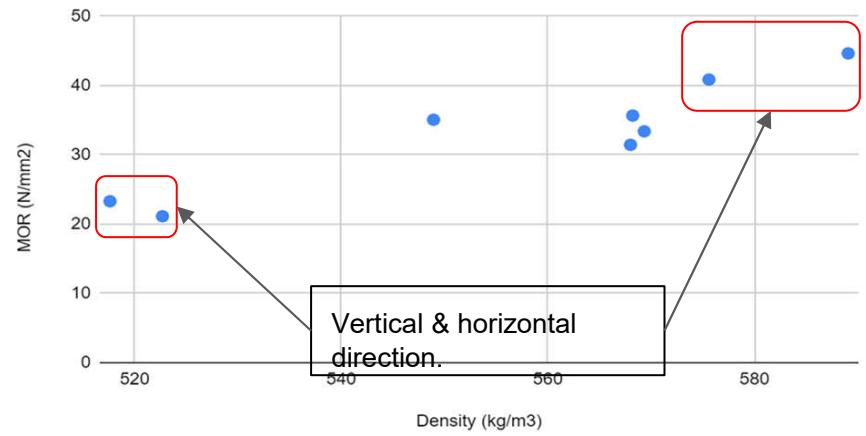
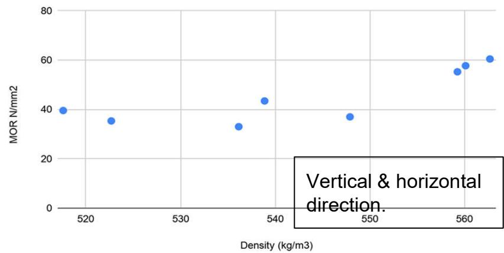
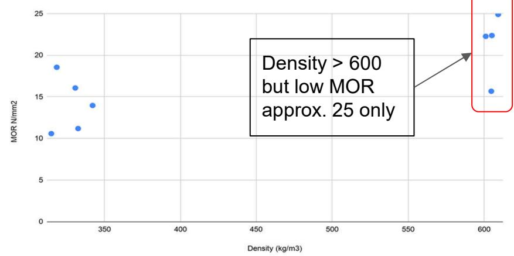
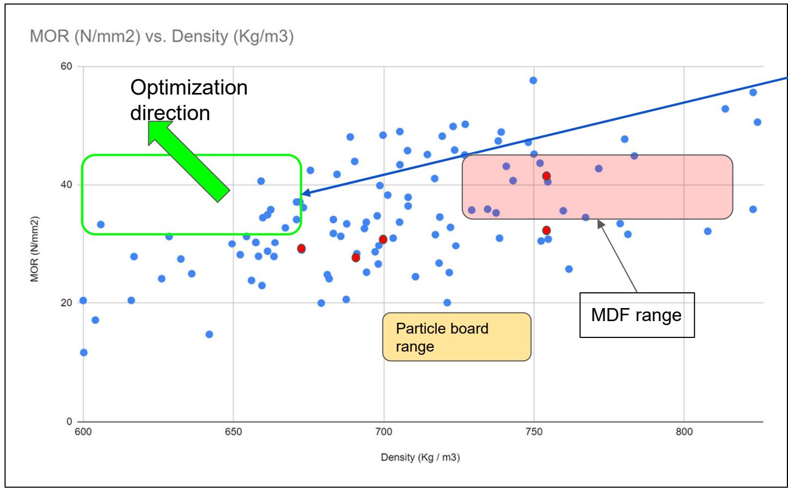
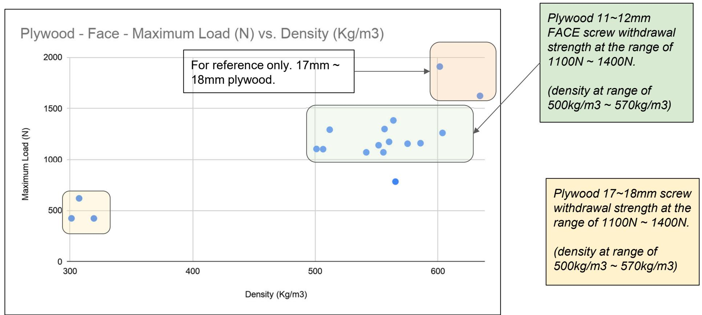
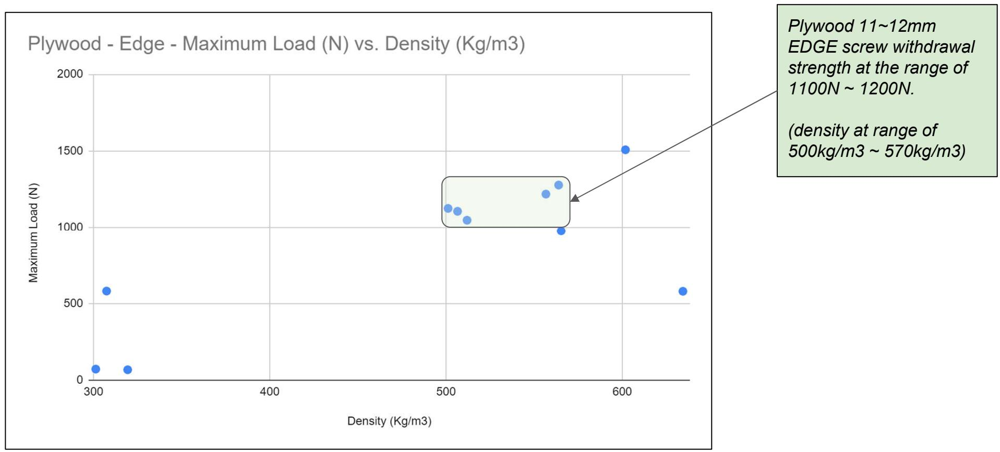
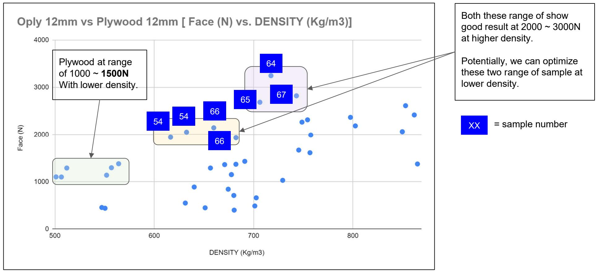
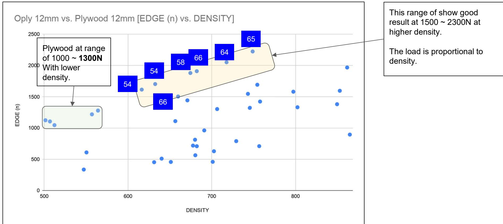

Simplified Comparison Table   

<table><tr><td rowspan="2"></td><td colspan="2">Oply 12mm</td><td colspan="2">Plywood 12mm</td><td rowspan="2">Remark</td></tr><tr><td>min</td><td>max</td><td>min</td><td>max</td></tr><tr><td>Density (kg/m3)</td><td>600</td><td>725</td><td>500</td><td>600</td><td>Plywood is lighter by approx. 20% ~ 25%.</td></tr><tr><td>Modulus of Rupture (N/mm2)</td><td>30</td><td>50</td><td>30</td><td>60</td><td>Plywood has two axis - one axis is always greater than the other. Oply MOR is within the range. no different in two axis.</td></tr><tr><td>Thickness Swelling 24 hrs</td><td>8%</td><td>12%</td><td>8%</td><td>14%</td><td>Both are about the same.</td></tr><tr><td>Internal Bonding (N/mm2)</td><td>1</td><td>2</td><td colspan="2">Not Applicable</td><td>To measure the strength of core.
Note: for plywood - Chisel Test for the bonding quality between plies.
IB of Oply is better than typical particle board &amp; MDF (at range of 0.8)</td></tr><tr><td>Surface Soundness</td><td colspan="2">Not yet carried out</td><td colspan="2">Not Applicable</td><td>To measure the quality of surface.</td></tr><tr><td>Face Screw Withdrawal (N)</td><td>1,900</td><td>2,200</td><td>1,100</td><td>1,400</td><td rowspan="2">Oply is better than plywood in both face and edge.</td></tr><tr><td>Edge Screw Withdrawal (N)</td><td>1,400</td><td>1,900</td><td>1,050</td><td>1,300</td></tr></table>

# Oply Test Result - Analysis 1 - Thickness Swelling 24 hr vs. density

  
MOR vs. Density (kg/m3) - 9mm Plywood

  
MOR N/mm2 vs. Density (kg/m3) - 12mm

  
MOR N/mm2 vs. Density (kg/m3) - 16mm ~ 17mm Plywood

# PLYWOOD MOR vs. Density Summary:

1. The density and MOR are proportional.   
2. Same density NOT necessary shows similar MOR. Comparing 16mm & 12mm, approx. same density, 16mm MOR is much lower than 12mm MOR even 16mm is thicker than 12mm, 16mm max MOR is only 25N/mm2 whereas 12mm min MOR is above 30N/mm2.   
3. Different orientation shows different MOR by approx double in value.

  
Oply Test Result - Analysis 2 - MOR vs. density

Commonality:

fiber HK was

hammermill 1 x with

screen size

12mm/shieved to

remove dust and flour

dust/Resin no heating

45C/pmdi sg buloh/sc

95%/fiber length 2.82

cm(AVG)

MOR range 35 ~ 40+

Sample:

68, 69, *70 & *71

*70 & 71 resin 11%.

Resin $10\%$ sample 56

Resin no heating.

NOTE: ALL these

sample data with TS at

range $9\%$ - $12\%$ .

  
Oply Test Result - Analysis 3a - Plywood Screw Withdrawal Test

  
Oply Test Result - Analysis 3b - Plywood Screw Withdrawal Test

  
Oply Test Result - Analysis 3c - Oply FACE Screw Withdrawal Test

# Oply Test Result - Analysis 3d - Oply EDGE Screw Withdrawal Test

